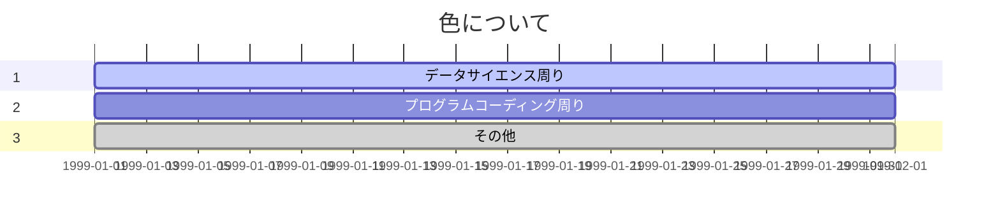
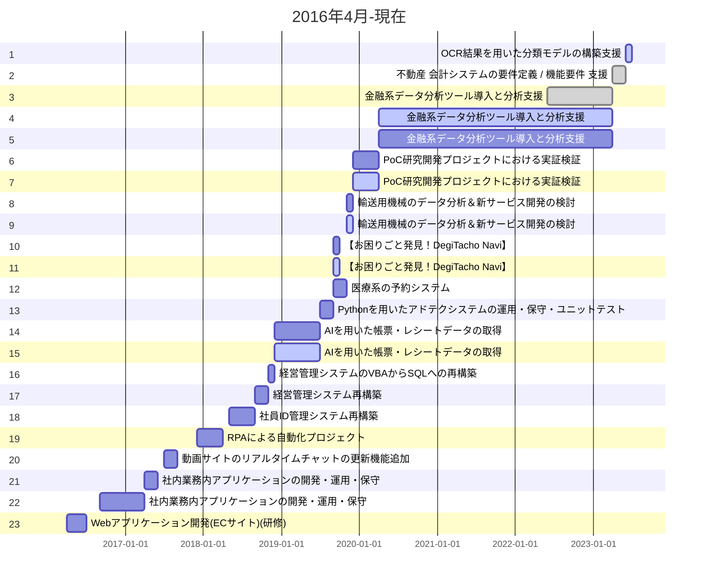

# 職務経歴書

## 概要

エンジニア歴(プログラムに触れたこと)は2016年4月からです。
バックエンド開発に約3年従事後、データ分析業務に従事してきました。直近ではユーザーとの折衝を主とした業務を従事しました。
私の強みはバックエンド / フロントエンド / データ環境構築 / 事業施策実行を経験していることです。各業務を経験しているからこそ、プロジェクトを進めるために必要 / 不要な点を列挙し、チームとしてパフォーマンスを最大化できるのだと確信しております。
もちろん、バックエンド / データ環境構築 / 事業施策実行は1人で業務を遂行可能であり、その時と場合によって必要な技術は異なるかと思いますが都度調整しながら目標を達成させてください。

## 職務経歴概要

### 見方

### スキルの変遷

## スキル一覧
### 見方
- 言語(期間: 実施年/月 or 開始年/月 - 終了年/月)
    - 経験概要

### 実歴(エンジニアリング)
- Python(2018/12-2023/3)
    - データ分析・運用実装
    - Flask
    - Keras / TensorFlow(画像系)
    - 自然言語処理 単語抽出
- R(2019/12-2023/3)
    - データ分析 / 可視化(ShinyでMap)
    - 決定木(ルール作成)
- Java(2016/4-2017/5)
- JavaScript(短期間)
- TypeScript(短期間)
- Angular2系(短期間)
    - 画面レイアウト元、カレンダー機能、Redux
- Go(短期間)
- Docker(短期間)
- SAS 9系(2020/4-2023/3)

### 実績(プロジェクトマネジメント)
- PM(2022/4-2023/6)

## 保有資格

|資格|取得年/月|
|:----|-------:|
| Java Silver SE8 | 2016/7 |
| 基本情報技術者試験 | 2016/10 |
| JDLA E資格 | 2019/2 |

※更新の必要なものは失効していますが、参考として

## 案件詳細

- OCR結果を用いた分類モデルの構築支援
    - プロジェクトマネジメント

- 不動産 会計システムの要件定義 / 機能要件 支援
    - プロジェクトマネジメント

- 金融系データ分析ツール導入と分析支援
    - AI・機械学習
    - データ前処理
    - 実運用・支援

- PoC研究開発プロジェクトにおける実証検証
    - サーバ 構築(ハードウェア上、AWSクラウド)
    - ハードウェア 構築
    - AI・機械学習

- 輸送用機械のデータ分析＆新サービス開発の検討
    - データ前処理
    - データ可視化
    - デモ用 VBA処理 高速化

- お困りごと発見！DegiTacho Navi
    - 要件 検討&落込
    - データ(時系列) 前処理
    - AI・機械学習

- 医療系の予約システム
    - フロントエンド 構築&開発
    - サーバサイド 構築&開発

- Pythonを用いたアドテクシステムの運用・保守・ユニットテスト
- Vue.js、Node.jsを用いたユーザーアカウント管理システム
    - 障害 対応
    - ユニットテスト 作成

- AIを用いた帳票・レシートデータの取得
    - データ前処理
    - サーバ 構築
    - AI・機械学習

- 経営管理システムのVBAからSQLへの再構築
    - システム要件 確認
    - VBA ACCESS→SQL

- 経営管理システム再構築
    - ユーザー要件 検討&調整
    - 詳細設計書 検討&調整
    - サーバサイド　開発

- 社員ID管理システム再構築
    - ユーザー要件 検討&調整
    - 詳細設計書 検討&調整
    - サーバサイド　開発

- RPAによる自動化プロジェクト
    - ユーザー要件 ヒアリング&検討
    - 要件抽出
    - RAP 開発&運用

- 動画サイトのリアルタイムチャットの更新機能追加
    - 詳細設計 上長とペアプログラミング

- 社内業務内アプリケーションの運用・保守
    - 既存システム 運用&保守
    - ユーザー 折衝

- Webアプリケーション開発(ECサイト)(研修)
    - サーバサイド 開発

<!--
**chibadai/chibadai** is a ✨ _special_ ✨ repository because its `README.md` (this file) appears on your GitHub profile.

Here are some ideas to get you started:

- 🔭 I’m currently working on ...
- 🌱 I’m currently learning ...
- 👯 I’m looking to collaborate on ...
- 🤔 I’m looking for help with ...
- 💬 Ask me about ...
- 📫 How to reach me: ...
- 😄 Pronouns: ...
- ⚡ Fun fact: ...
-->
